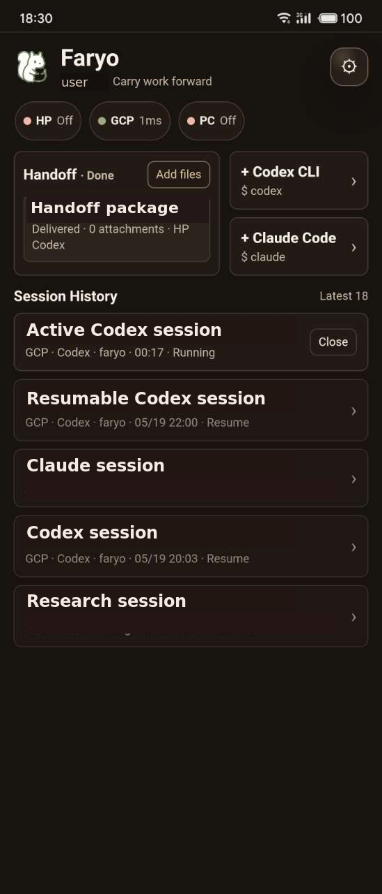
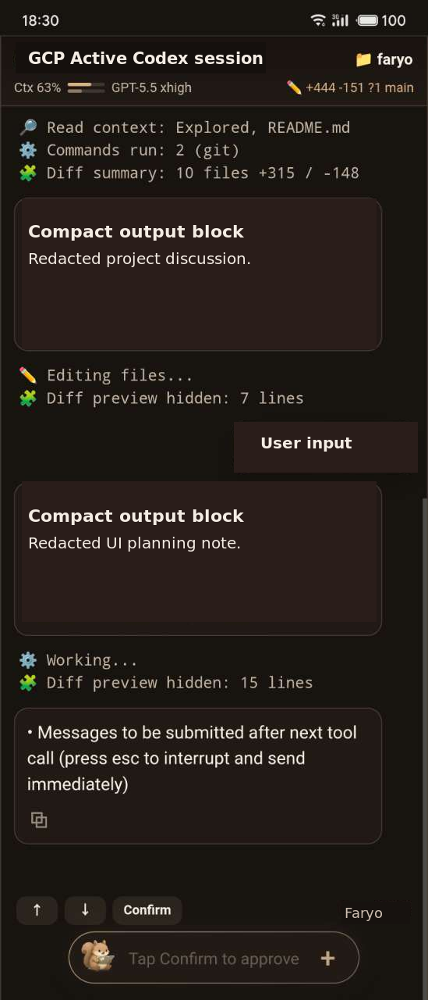

# Faryo

Canonical repository: https://github.com/Snailflyer/faryo

Faryo is a lightweight mobile workbench for tmux-backed Codex CLI, Claude Code,
and shell sessions.

It turns long-running Codex, Claude, and shell-based sessions into a mobile
workbench without replacing the terminal runtime. The browser is only the
control surface. The original `tmux` session remains the source of truth.

Read the launch note:
[`Faryo: mobile workbench for tmux-backed Codex and Claude sessions`](docs/launch/faryo-1.0.0.md).

## Why Faryo Exists

1. AI development is no longer limited to one desk session.
   Work continues while the user is walking, commuting, waiting, reviewing, or
   thinking through the next instruction.

2. Remote access is not the same as work continuity.
   A remote terminal can show a screen, but it usually does not solve the harder
   problem: phone and desktop must keep operating the same session history.

3. The session is the valuable object.
   The useful state is not a web page. It is the live terminal process, its
   scrollback, approvals, interruptions, working directory, attachments, and
   resumable AI context.

4. Mobile AI work should not create a second branch of history.
   If a phone instruction cannot be seen and continued later from the desktop,
   the workflow is broken.

5. `tmux` is the smallest reliable truth layer for this job.
   It already keeps terminal processes alive, preserves scrollback, supports
   attach/detach, and works with Codex, Claude, and shell TUIs without asking
   them to change.

6. Lightweight matters because this is a high-frequency tool.
   The user may open it dozens of times a day to check output, send one
   instruction, approve an action, or attach a file. Heavy dependencies would
   make the product harder to trust and easier to abandon.

7. Faryo should not own speech-to-text.
   Phone keyboards and system dictation already handle voice input well. Faryo's
   responsibility starts after text exists: deliver it into the right live work
   session without breaking continuity.

8. Multi-endpoint work needs one cockpit.
   HP, PC, and cloud machines should feel like available places in one work
   network, not isolated URLs with separate memory.

9. Handoff needs more than a prompt box.
   Real work often carries screenshots, logs, files, notes, and intent. Faryo
   packages those materials and brings them into the target session.

10. Open source matters because this is personal infrastructure.
    The tool controls local terminals and developer context. It should be small,
    inspectable, self-hostable, and easy to adapt without a hosted platform
    dependency.

## What Faryo Is

1. A mobile workbench for terminal AI sessions.
   It lets a phone or desktop browser inspect output, send instructions, approve
   actions, and continue work without opening a raw terminal.

2. A continuity layer over `tmux`.
   Faryo does not replace the terminal runtime. It keeps the live tmux session,
   process, scrollback, and working directory as the shared truth.

3. A Gateway for public access and policy.
   Gateway handles login, route authorization, endpoint health, session
   selection, handoff packages, and controlled proxying to Owner endpoints.

4. A local Owner endpoint for execution control.
   Owner binds to loopback, captures tmux output, sends text, handles
   interrupts and approvals, uploads attachments, and discovers resumable
   Codex/Claude history.

5. A cross-device session history surface.
   The phone and desktop operate the same session history instead of creating
   separate mobile-only or desktop-only branches.

6. A handoff package inbox.
   Prompts, notes, screenshots, files, and intent can be packaged and injected
   into a selected live session.

7. A multi-endpoint cockpit.
   HP, PC, and cloud endpoints appear as routable places in one workbench while
   keeping their execution tokens and local runtimes separate.

8. A thin PWA interface.
   The UI is intentionally small: compact output, raw output, session switching,
   attachment upload, and command input.

9. A self-hosted endpoint runtime.
   The packaged Owner runtime is suitable for local machines. Gateway remains
   source-deployed as the public routing and policy layer.

10. A deliberately small tool, not a platform lock-in.
    Faryo is not a hosted IDE, not a remote desktop, not a speech-to-text
    service, and not another AI chat product.

## Product Shape

Faryo is a thin workbench over terminal-native AI sessions.

The user wants the phone and computer to operate the same living workspace:

- one shared terminal-backed session history
- fast phone input without opening a full terminal
- desktop continuity after mobile instructions
- Codex and Claude resume instead of disposable chat pages
- attachments and notes carried into the active context
- lightweight runtime behavior with few dependencies and no remote desktop stack

Faryo does not ship speech-to-text. Use the phone keyboard, system dictation, or
any input method you prefer; Faryo's job is to keep the workbench continuous.

## How It Works

Faryo has two small components:

```text
phone / desktop browser
  -> Faryo Gateway
  -> Owner endpoint
  -> tmux session
  -> Codex, Claude, or shell TUI
```

`apps/gateway` is the public workbench. It owns login, route authorization,
endpoint health, session selection, handoff packages, and proxying to Owner
endpoints. Owner tokens are injected server-side and are not exposed to the
browser.

`apps/owner` is the local execution surface. It binds to loopback, controls a
target `tmux` pane, captures terminal output, sends text, uploads attachments to
a configured inbox, and discovers resumable Codex/Claude history.

The browser UI stays thin. It renders the workbench, sends commands, uploads
attachments, and switches sessions; it does not replace the terminal runtime.

The endpoint package intentionally includes only Owner. Gateway is source
deployed because it is the public routing and policy layer.

## Endpoint Fit

Faryo is built around a lightweight browser workbench, but endpoints and
browsers do not behave identically.

The most refined path today is:

```text
Linux endpoint
  + tmux
  + Codex CLI
  + Chrome / Android Chrome PWA
```

That path has received the most tuning for mobile viewport behavior, PWA use,
compact output, command input, attachment handling, session switching, and
Codex history convergence.

Supported but less heavily polished paths:

- macOS Owner packaging through the launchd installer.
- iOS Safari as a browser surface.
- Claude Code session discovery and compact rendering.
- Generic shell TUIs controlled through tmux capture/send.

These paths are usable, but they may need additional refinement around browser
viewport behavior, backgrounding, paste/input edge cases, compact rendering, and
agent-specific session history mapping.

## Agent Convergence

Faryo treats "session convergence" as the process of making four things line up:

```text
active tmux session
  + visible terminal process
  + agent history record
  + workbench session card
```

Different agents expose different state, so Faryo uses different convergence
rules.

Codex is the most mature integration:

- reads the Codex local session database
- filters internal and subagent branches from normal history
- maps the active tmux process back to the current Codex thread
- resumes sessions through `codex resume`
- applies Codex-specific compact output rules

Claude is supported with a different path:

- reads Claude project JSONL history
- tracks managed Claude tmux sessions with Faryo tmux metadata
- resumes sessions through Claude session IDs
- applies Claude-specific compact output rules

Claude convergence is intentionally separate from Codex convergence. It is not
as heavily tuned yet, especially across macOS, iOS Safari, and less common
Claude output states.

Generic shell sessions are controlled through tmux only. They can be captured,
viewed, and sent input, but they do not have Codex/Claude-style semantic history
convergence.

## UI Interaction Model

Faryo's UI is a cockpit, not a document editor and not a chat clone. The main
screen is optimized for repeated mobile checks and short control actions.

Screenshots below are redacted examples. Session titles and project discussion
content are replaced with representative labels.

<p>
  
  
</p>

Core interactions:

- Workbench first: Gateway opens to route status, active sessions, recent
  history, and pending handoff packages.
- Session cards: each card represents a resumable agent session or active tmux
  session. Opening a card routes the browser to that endpoint and session.
- Compact output: the default mobile view reduces noisy terminal output into
  readable work blocks while keeping the session grounded in terminal history.
- Raw output: full terminal capture is available when exact terminal evidence is
  needed.
- Latest control: when the user scrolls up, Faryo does not force-jump the view;
  new output waits until the user taps the latest control.
- Composer: the bottom input sends text into the active tmux pane. It works well
  with mobile keyboards and system dictation.
- Attachments: images and files can be uploaded into the configured inbox and
  referenced in the active session.
- Handoff packages: prompts, notes, screenshots, and files can be picked up and
  injected into a selected session.
- Agent controls: interrupt, approve, page up/down, resume, and close actions
  are exposed as direct controls instead of hidden terminal shortcuts.
- Thin state: the browser remembers display preferences, but the work session
  itself remains in tmux and the agent history store.

The UI intentionally avoids heavyweight panels and IDE-style layout. It should
feel fast enough to open, inspect, dictate a command, attach context, and leave.

## Core Features

- Mobile-first PWA workbench with compact and raw terminal views.
- Shared session history across phone and desktop through the same `tmux`
  session.
- Codex and Claude session discovery, resume, interrupt, and approval controls.
- Multi-endpoint routing for local machines and cloud endpoints.
- Handoff packages for prompts, notes, images, and files.
- Lightweight attachment handling with local inbox paths.
- No browser automation, no remote desktop stack, and no database server in the
  runtime path.

## Runtime State

Source code lives in this repository. Runtime configuration and secrets do not.

```text
~/.faryo/
  gateway/
    config/faryo.env
    config/gateway-auth.json
    state/
    logs/
  owner/
    config/faryo.env
    data/
```

Example configuration files live under:

```text
apps/gateway/config/faryo.env.example
apps/owner/config/faryo.env.example
```

## Requirements

Owner endpoint:

- Python 3.11 or newer
- `tmux`
- `curl`
- `zsh`
- optional: `git`, `openssh-client`, Codex CLI, Claude Code

Gateway:

- Python 3.11 or newer
- `bcrypt`
- a reverse proxy such as Caddy or nginx for public HTTPS

## Packaging

Endpoint releases are built from `apps/owner/RELEASE`.

```bash
scripts/package-client.sh check
scripts/package-client.sh release
```

The release target builds:

```text
dist/faryo_<version>_all.deb
dist/faryo_<version>_macos.tar.gz
dist/SHA256SUMS
```

Install the Linux endpoint package on an Owner machine:

```bash
sudo dpkg -i dist/faryo_<version>_all.deb
systemctl --user daemon-reload
systemctl --user enable --now faryo-owner-keepalive.timer
```

After configuration, the Owner health and status endpoints should answer on
loopback. `releaseVersion` in `/api/status` is the endpoint version to use for
upgrade acceptance.

## Repository Layout

```text
apps/gateway/       Public gateway, login, routing, and handoff workbench
apps/owner/         Local tmux-backed execution endpoint
packages/shared/    Shared code and contracts as they are extracted
docs/               Product, launch, release, UI, and client sync notes
deploy/             Runtime unit templates
scripts/            Packaging, endpoint install, and verification tools
```

## Security Model

Faryo is designed for a trusted operator running their own endpoints.

- Owner should bind only to `127.0.0.1`.
- Public access should go through Gateway.
- Tokens, password hashes, cookie secrets, and runtime env files are private
  runtime state.
- File preview and attachment APIs are token-protected and constrained by
  supported file types.
- Gateway bridge URL attachments reject private, loopback, link-local,
  multicast, reserved, and unresolved hosts.

See `SECURITY.md` for the short disclosure and deployment guidance.

## License

Faryo is released under the MIT License. See `LICENSE`.
