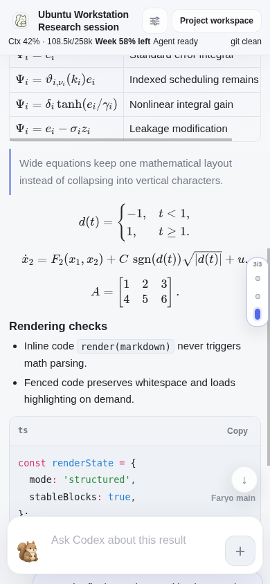
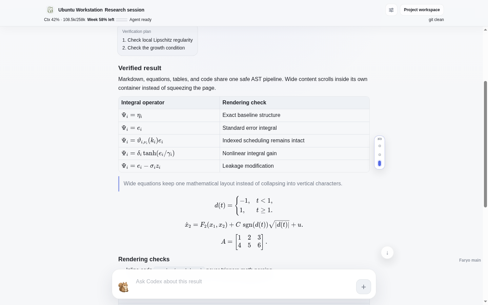
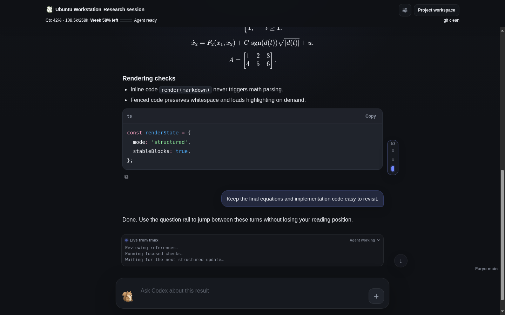

# Faryo

Faryo is a self-hosted mobile and desktop workbench for controlling the same
live `tmux`-backed Codex CLI session that is already running on an Ubuntu/Linux
workstation.

It lets one trusted operator read structured Codex history, inspect live terminal
activity, send follow-ups, attach files, approve or interrupt work, and return to
the same desktop session. It is not remote desktop, a hosted IDE, a browser
terminal, or a second AI chat history.

This repository is a personal fork of
[Snailflyer/faryo](https://github.com/Snailflyer/faryo). The original project is
tracked as `upstream`; this fork is maintained at
[SongJunguo/faryo](https://github.com/SongJunguo/faryo).

## Why This Fork

Most lightweight tmux web bridges can only reproduce terminal text. This fork
uses Codex's structured rollout history for the reading experience while keeping
the existing tmux TUI as the execution surface.

- **Formula-first reading:** original Markdown and TeX render through a safe AST
  pipeline and local KaTeX, including tables, cases, matrices, indexed operators,
  and wide display equations.
- **One real session:** phone, desktop browser, and terminal all control the same
  live Codex/tmux session instead of creating a detached web chat.
- **Long-conversation navigation:** structured history stays bounded, and a
  fast-scroll question rail jumps between prior user turns.
- **Reliable remote input:** delivery is confirmed, idempotent across retries and
  restarts, isolated by session, and preserves drafts on ambiguous failures.
- **Self-hosted security boundary:** Owner and Gateway stay on loopback behind an
  operator-controlled identity-aware HTTPS edge.

## Real UI Screenshots

<p align="center">
  
  
</p>

<p align="center">
  
</p>

<p align="center"><sub>Generated by the repository's real Chrome/Edge browser regression with an anonymous fixture. No private conversation, account, hostname, path, domain, or token is present.</sub></p>

## Maintained Scope

The current `main` branch is source-deployed and Codex-focused. Its maintained
acceptance path is:

```text
Ubuntu/Linux workstation
  -> tmux
  -> Codex CLI
  -> Faryo Owner on loopback
  -> Faryo Gateway on loopback
  -> Cloudflare Tunnel + Access (or another hardened HTTPS edge)
  -> current Chrome or Microsoft Edge on phone/desktop
```

This fork does **not** currently publish or maintain binary release packages.
Historical distribution and non-Codex platform paths may remain in the tree for
upstream compatibility, but they are not part of this fork's current validation
or support claims.

## Current Functionality

### Structured Codex conversation

- Reads finalized user/assistant messages incrementally from Codex rollout JSONL.
- Uses Codex App Server only as a compatibility fallback and tmux capture as
  conservative terminal evidence.
- Keeps recent complete turns within explicit tail, line, and character budgets.
  Formula-heavy answers cannot silently hide the entire recent conversation.
- Separates stable conversation history from the transient `Live from tmux`
  execution panel.

### Markdown, formulas, and code

Compact Chat uses one local rendering pipeline:

```text
micromark -> mdast -> CommonMark/GFM/math nodes -> safe HTML -> KaTeX
```

- Supports GFM tables, task lists, strikethrough, autolinks, CJK punctuation,
  `$...$`, `$$...$$`, `\(...\)`, and `\[...\]`.
- Keeps TeX inside code literal and lets wide formulas, tables, and code scroll
  inside their own containers.
- Uses local KaTeX CSS/fonts and lazy local Shiki language chunks; production
  rendering does not require a CDN or Node process.
- Escapes raw HTML, restricts URL protocols, and runs KaTeX with `trust: false`.
- Falls back per message to safe plain text when rich rendering fails, without
  stopping later live updates.

### Long-conversation navigation

- Builds a right-edge marker for each visible user question.
- Stays hidden during normal reading and appears only after a fast user
  wheel/swipe.
- Auto-hides after scrolling stops, while hover and keyboard focus keep it
  available.
- Supports click, arrow keys, Home, and End for jumping between questions.
- Overlays the extreme mobile edge without reserving permanent blank space or
  changing conversation width.
- Reuses stable marker DOM during live appends and stores no question text or
  navigation state in browser storage.

### Reliable browser-to-Codex delivery

- Keeps an immutable session, message ID, text, and attachment snapshot across
  retries.
- Serializes one tmux composer per session without blocking unrelated sessions.
- Confirms Codex submission from exact rollout, new queue, or safe idle-composer
  evidence instead of treating every cleared input as success.
- Persists minimal `pasted`/`accepted` idempotency state with mode-`600` files;
  message bodies and rollout paths are not stored.
- Returns an explicit ambiguous failure when evidence is insufficient, without
  re-pasting or blindly sending another key.
- Preserves browser and TUI drafts after conflicts, timeouts, or failed sends.

### Workbench interaction

- Uses the Faryo logo as a direct return to the Gateway home page while the
  adjacent session title keeps its independent header-collapse action.
- Keeps a large composer geometry across focus, blur, and mobile keyboard state.
- Shows agent-reported context used/window and weekly quota when available.
- Preserves the main reading position during structured refreshes.
- Preserves manual scroll inside an expanded Live tmux panel.
- Provides Chat/Raw views, attachments, approve, interrupt, page navigation,
  session switching, and a return-to-latest control.
- Does not resize Codex or tmux windows; real tmux clients remain the source of
  terminal dimensions and wrapping.

### Gateway session management

- Keeps active tmux-backed Codex sessions separate from resumable history.
- Shows every recognized active Codex pane, including desktop-started sessions.
- Keeps history server-paginated at 10 records per page with Previous/Next and
  direct page-number navigation.
- Allows remote Close only for sessions that Faryo created and stamped.
- Injects Owner tokens server-side so public browser URLs do not contain them.

## Architecture

```text
phone / desktop browser
  -> identity-aware HTTPS edge
  -> Faryo Gateway (127.0.0.1:8780)
  -> Faryo Owner   (127.0.0.1:8765)
  -> existing tmux pane
  -> Codex CLI
```

Gateway owns public login, route authorization, session/history navigation, and
proxying. Owner owns the local structured capture, tmux controls, attachments,
and Codex-specific delivery state machine. The browser is a thin authenticated
control surface; the durable work remains in tmux and Codex's own history.

## Source Deployment

### Requirements

- Ubuntu/Linux
- Python 3.11 or newer; Python 3.13 is the validated project environment
- `tmux`, `curl`, and `git`
- Codex CLI
- `bcrypt` for Gateway
- current Chrome or Microsoft Edge
- a public HTTPS edge only when remote access is required

Create an isolated environment rather than modifying Conda base:

```bash
git clone https://github.com/SongJunguo/faryo.git
cd faryo

conda create -n faryo python=3.13
conda activate faryo
python -m pip install -r apps/gateway/requirements.txt
```

Initialize private Owner configuration with the Gateway URL that will be used by
the deployment:

```bash
FARYO_PYTHON="$CONDA_PREFIX/bin/python" \
FARYO_PROJECT_WORKBENCH_GATEWAY_URL="https://gateway.example" \
  ./apps/owner/scripts/init-owner-env.sh
```

Then initialize a single local Gateway route and start both services:

```bash
FARYO_PYTHON="$CONDA_PREFIX/bin/python" \
FARYO_GATEWAY_ROUTE=txy \
  ./apps/gateway/scripts/init-local-gateway.sh

./apps/owner/scripts/start-web-owner.sh
./apps/gateway/scripts/install-user-service.sh
```

The initializer writes private runtime state below `~/.faryo/`. Review the
generated mode-`600` files, change the initial Gateway password, and never commit
tokens, password hashes, Cookie secrets, tunnel credentials, or real domains.

Verify the loopback services:

```bash
curl --noproxy '*' -fsS http://127.0.0.1:8765/health
curl --noproxy '*' -fsS http://127.0.0.1:8780/login >/dev/null
```

For remote access, follow the [Gateway runbook](apps/gateway/runbook.md) and
[security hardening guide](docs/gateway-security-hardening.md). A Cloudflare
Tunnel is transport only; protect the complete hostname with Cloudflare Access
or an equivalent exact-identity layer.

## Current Validation

The `main` branch was revalidated on 2026-08-19 with privacy-safe fixtures:

- release checks plus 56 Owner and 44 Gateway Python tests;
- a 20-message browser delivery matrix including Chinese, multiline Markdown,
  TeX, attachment, offline/background recovery, and failed-draft cases;
- a two-session retry/delayed-response isolation test;
- 390x844 mobile Chrome and 1440x900 desktop Edge long-conversation tests;
- fast-scroll question-rail reveal, auto-hide, keyboard navigation, stable live
  append, and unchanged conversation width;
- local Markdown/KaTeX/Shiki, authenticated resources, CSP, and safe fallback;
- a real structured Codex session with 12 question markers without recording its
  conversation text;
- a 263.3 MiB rollout cold-read check at about 0.0025 s and 41.5 MiB process peak
  RSS on the validated workstation;
- Owner/Gateway health and unchanged dimensions for five active Codex tmux
  sessions after deployment.

Run the repository release checks with the selected project environment:

```bash
PATH="$CONDA_PREFIX/bin:$PATH" scripts/package-client.sh check
```

The check target validates source syntax, browser bundles, Owner tests, and
required runtime asset inclusion. It does not mean that this fork currently
publishes a binary package.

## Security Boundary

Faryo can steer Codex with the permissions of the operating-system user running
Owner. Treat it as a remote administration surface.

- Bind Owner and Gateway only to loopback/private interfaces.
- Never expose Owner directly to the Internet.
- Put identity-aware access in front of the complete Gateway hostname.
- Use exact identities or a small managed group; configure no broad bypass.
- Keep the inner Faryo password/Cookie layer enabled.
- Treat Access session duration/MFA and the inner Faryo Cookie as independent,
  operator-selected controls.
- Use OS, VM, or container isolation when the Codex user must not read personal
  browser, SSH, Git, or other workstation data.
- Keep runtime secrets and private conversations outside Git and logs.

See [SECURITY.md](SECURITY.md) and
[Gateway Security Hardening](docs/gateway-security-hardening.md).

## Repository Layout

```text
apps/owner/         Loopback tmux/Codex execution endpoint
apps/gateway/       Authenticated routing and session/history workbench
apps/shared/        Shared state and browser appearance helpers
docs/               Security, deployment, and implementation plans
deploy/             Runtime unit templates
scripts/            Source checks and maintenance scripts
tools/              Development-only Markdown bundle builder
```

## Documentation

- [Owner runtime and Compact Chat](apps/owner/local-tmux-owner/README.md)
- [Gateway setup](apps/gateway/README.md)
- [Gateway runbook](apps/gateway/runbook.md)
- [Gateway security hardening](docs/gateway-security-hardening.md)
- [Current UI interaction contract](docs/ui-interaction.md)
- [Current UI plan and evidence](docs/plans/deepseek-inspired-ui-plan.md)
- [Codex reliability plan and evidence](docs/plans/codex-reliability-hardening-plan.md)
- [Personal fork roadmap](docs/plans/personal-fork-roadmap.md)

## Inspiration and Acknowledgements

Faryo's modern agent-workbench direction was inspired in part by
[DeepSeek Harness](https://github.com/deepseek-ai/deepseek-harness). Its
math-delimiter and CJK-friendly Markdown compatibility extensions are adapted
from [a pinned DeepSeek Harness revision](https://github.com/deepseek-ai/deepseek-harness/tree/47f943859bef60e4160492346772ded9b24f765a)
under the MIT License.

Faryo remains an independent project and is not affiliated with or endorsed by
DeepSeek. No DeepSeek branding or product assets are included. Complete
attribution and license information is available in the
[bundled third-party notices](apps/owner/local-tmux-owner/static/vendor/markdown-ast/THIRD_PARTY_NOTICES.md).

## Upstream and License

The original Faryo project is maintained by
[Snailflyer](https://github.com/Snailflyer/faryo). This fork preserves the
upstream remote for comparison but pushes personal changes only to
[SongJunguo/faryo](https://github.com/SongJunguo/faryo).

Faryo is released under the MIT License. See [LICENSE](LICENSE).
