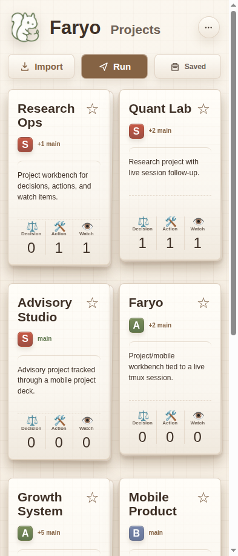
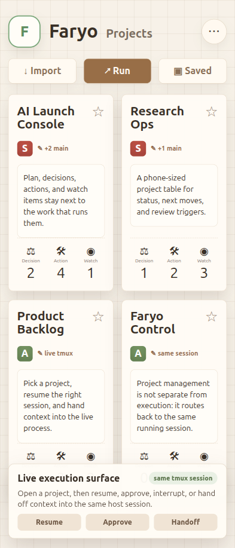
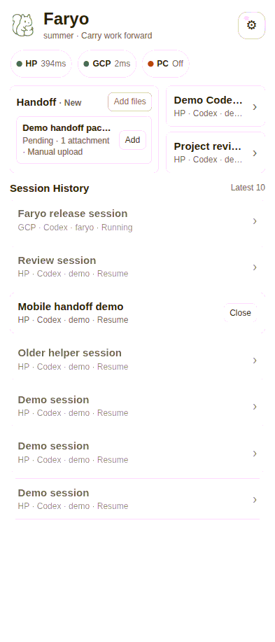

# Faryo UI Interaction Model

Faryo is designed as a project and mobile workbench for terminal AI sessions.

The UI should feel closer to a cockpit than a chat app. It gives the user quick
access to project cards, owner decisions, route health, sessions, output,
input, handoff packages, attachments, and agent controls while leaving the
terminal runtime in `tmux`.

Screenshots below are redacted examples. Session titles and project discussion
content are replaced with representative labels.

  
  
  
  

## UI Target Images

项目页 UI target（UI 目标图）统一放在 `docs/assets/ui-targets/`，包括项目总览大卡片和方向编辑面板的浅色/深色目标。

## Surfaces

### Projects Workbench

The Projects workbench is the project-level control surface.

It shows:

- project cards
- Decision, Action, and Watch counts
- stage goals and owner review state
- import, save, and run actions
- a compact Faryo input dock for the active session route

The project deck is not a standalone issue tracker. Its job is to keep project
state close to the live agent session that can execute the next action.

### Gateway Workbench

The Gateway workbench is the first authenticated surface.

It shows:

- available routes such as HP, PC, and cloud endpoints
- route health
- active and recent sessions
- pending handoff packages
- new-session entry points
- account and install controls

The workbench is for choosing where work should continue. It should not behave
like a file manager or a general dashboard.

### Owner Session View

The Owner session view is the control surface for one tmux-backed session.

It shows:

- owner/route label
- current topic/session title
- model and context metadata when available
- git status when available
- compact or raw terminal output
- attachment preview
- composer
- agent controls

## Output Modes

### Compact

Compact mode is the default mobile reading mode. It turns noisy terminal output
into readable blocks for common Codex and Claude states.

Compact mode is agent-specific:

- Codex rules are the most mature.
- Claude rules exist but need more tuning across platforms and output states.
- Generic shell output falls back to terminal-oriented rendering.

### Raw

Raw mode keeps the terminal evidence closer to its original form. It is useful
when the user needs exact command output, logs, or terminal formatting.

While an agent is working, the compact view may append a bounded `Live from
tmux` pane. Its scroll position follows terminal conventions: a pane already at
the bottom continues following new output, while a user who scrolls upward
keeps that reading position across live refreshes.

## Input

The composer sends text into the active tmux pane.

Design expectations:

- mobile keyboard and system dictation should work naturally
- sending one short instruction should be fast
- long prompts should remain possible
- attachments should become explicit file references in the session

Faryo does not own speech-to-text. It accepts the text produced by the user's
preferred input method.

## Session Selection

Session cards represent active or resumable work. A session card is not a copy
of a chat; it is a pointer back to terminal-backed state.

Codex cards converge through Codex history and the active tmux process. Claude
cards converge through Claude history and Faryo tmux metadata.

The Gateway home page presents two distinct session regions:

- `Active Sessions` always stays above history and lists all tmux panes with a
  recognized live Codex or Claude process. Desktop-created panes are marked as
  such and do not expose the Faryo-managed close action.
- `Session History` contains only inactive, resumable conversations. It has its
  own vertical scroll area and server-backed Previous/Next pages of 10 records,
  so active panes cannot disappear behind a history display limit.

## Handoff Packages

Handoff packages carry work material into a target session.

A package can include:

- prompt
- notes
- screenshots
- files
- intent
- context

Packages can be created from Gateway, received through the MCP bridge, and
injected into a selected session.

## Same-Session Handoff Walkthrough

1. Start from an existing Owner machine `tmux` session that is already running
   Codex, Claude Code, or a shell.
2. Open the Faryo Gateway workbench from a phone or desktop browser.
3. Select the route and the target live session. The browser talks to Gateway;
   Gateway proxies to Owner; Owner controls the selected `tmux` pane.
4. Review compact output from the target session. Use raw output only when exact
   terminal evidence is needed.
5. Send one short instruction from the workbench composer. The instruction
   appears in the same live `tmux` session.
6. Create a text handoff package from the Gateway workbench and inject it into
   the same target session. The session receives a `# Faryo Handoff Package`
   block.
7. Create an attachment handoff. Gateway uploads the file to the Owner inbox and
   injects the attachment path into the same target session.
8. Return to the desktop terminal and continue from that original session. No
   second chat history or remote desktop session is created.

Public proof assets:
`assets/screenshots/faryo-project-run-session-main.gif` and
`assets/screenshots/faryo-same-session-handoff-walkthrough.gif`.

The GIFs are captured from the real Gateway workbench at a 393 x 917 mobile
viewport. They show project Run dispatch, short input, text handoff, and
attachment handoff landing in `tmux`-backed sessions. Hostnames, paths, git
details, and private content are redacted.

## Control Actions

Faryo exposes common terminal-agent controls directly:

- send
- interrupt
- approve
- page up/down
- resume
- close session
- attach file or image

These controls keep mobile work practical without requiring the user to remember
terminal shortcuts on a phone.

## Platform Maturity

The most refined UI path is Chrome/Android Chrome PWA with a Linux endpoint and
Codex CLI.

Supported but less tuned:

- iOS Safari
- macOS Owner endpoint
- Claude Code compact states
- generic shell TUIs

Future UI work should focus on viewport behavior, background/foreground resume,
keyboard/paste edges, and better Claude-specific compact rendering.
